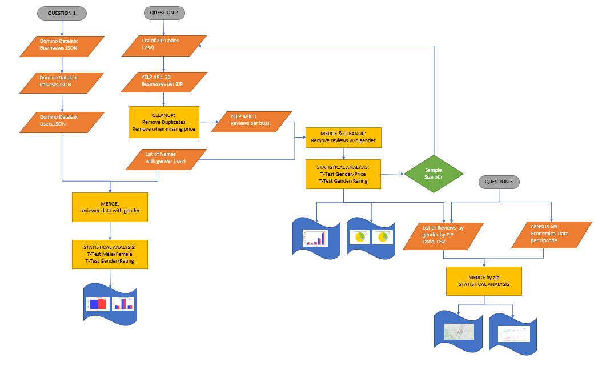

# Project 1 Gender Review Behaviour on YELP
In this Repo you will find the project 1 results as produced by Mary-Jane, Aukje and Tomislav.

It answers the questions:
Are men/women rated differently as reviewers?
Do men/women rate restaurants differently based on the price range ($ - $$$$) they fall in?
Do men/women, when they rate, give different ratings on average (1-5 stars)?
Does geographic location (based on zip-code) affect which type of restaurant men/women rate and what rating they give them?

Code can be found in:
Q1_Final.ipynb by MaryJane
Q2_Final.ipynb by Aukje Rijpkema
Q3_Final,ipynb by Tomislav Zlgo

Results can be found in Presentation.pptx as wel as the One Page Summary.doc.

Process flow overview:

 

